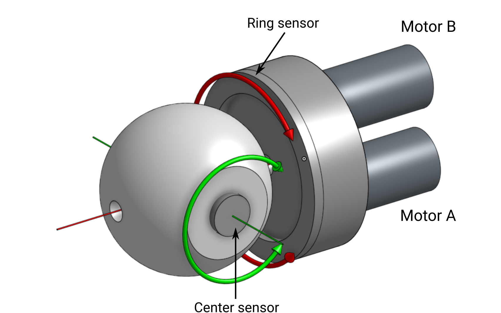

# Orbita2d actuator control libraries

## Overview

This repository contains all libraries required to control an Orbita2d actuator. It allows:
* to configure and test the actuator via a command-line or grapihcal tool
* to fully control the actuator using Python (only serial)
* access the full API (Rust package or C-API library)
* integrate the actuator in your ROS robot (URDF and ROS2 humble control hardware interface)

## Model definition

The actuator is defined by the following parameters:
* two motors ($A$ and $B$) with their respective reduction ratio ($r_{A}$ and $r_{B}$). **When not specified, they are always used in this order as argument or results.** Yet, you should never nead to control them directly.
* the output axes ($ring$ and $center$). **When not specified, they are always given in that order either as argument or results.**

Please refer to the following schema for more details:

## Usage

### Command line tool
### Configuration tool
### Via Python

## Contents

This repository contains the following sub-packages:

### Rust packages for control

* [orbita2d_kinematics](orbita2d_kinematics/README.md): forward/inverse kinematics model (in Rust)
* [orbita2d_control](orbita2d_control/README.md): low-level communication (serial or ethercat) and control (in Rust)

### C-API library and Python bindings

* [orbita2d c_api](orbita2d_c_api/README.md): plain C-API library to control the actuator
* [orbita2d python bindings](orbita2d_c_api/python/README.md): Python bindings for the C-API library

### Testing

* Unit test and doc-test: `cargo test`
* Hardware tests:
  - torque on/off: `cargo run --bin test_torque -- --config $(PWD)/orbita2d_controller/config/left_shoulder_flipsky.yaml`
  - velocity limit: `cargo run --bin test_velocity -- --config $(PWD)/orbita2d_controller/config/left_shoulder_flipsky.yaml`
  - torque limit: `cargo run --bin test_torque_limit -- --config $(PWD)/orbita2d_controller/config/left_shoulder_flipsky.yaml`

## Related repositories

* Mechanical design: [orbita2d_mechanical]()
* Electronics design: [orbita2d_electronics](https://github.com/pollen-robotics/orbita2d_elec)
* Firmware: [orbita2d_firmware](https://github.com/pollen-robotics/firmware_Orbita2Dofs)
